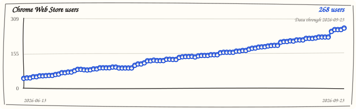
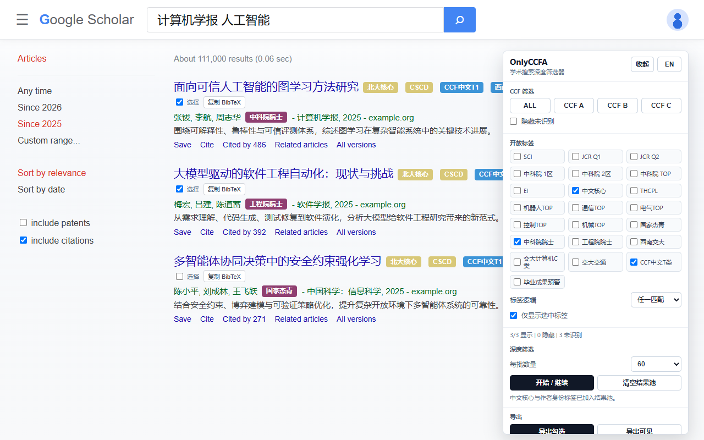
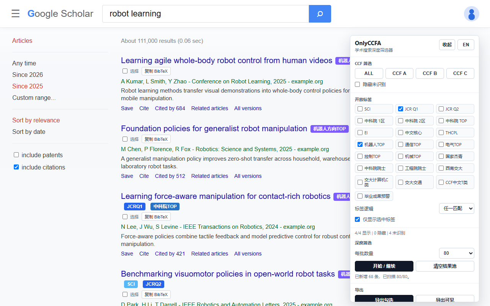
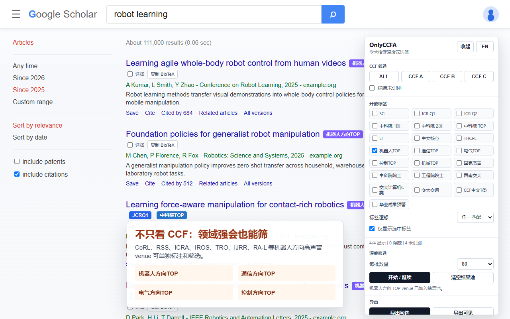
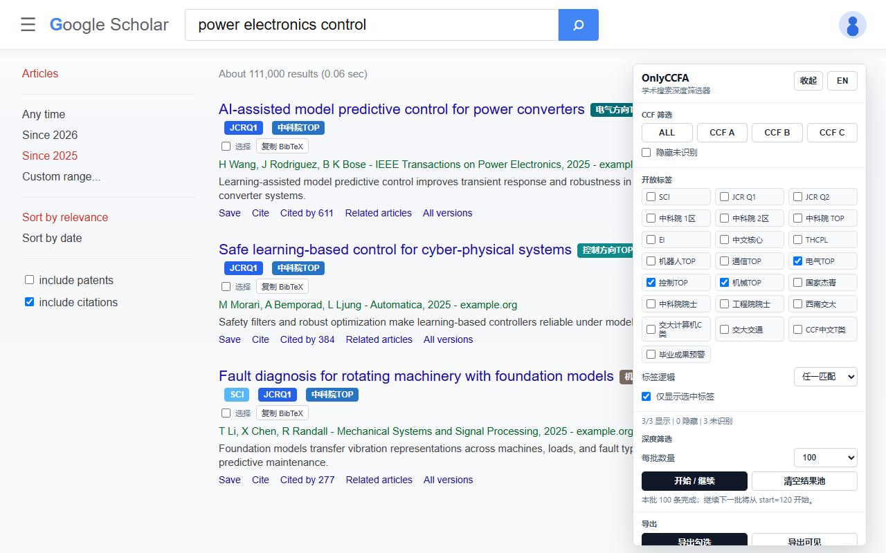
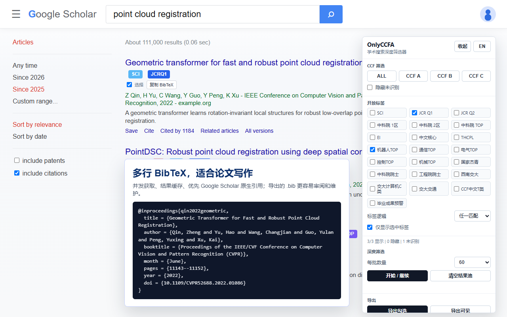
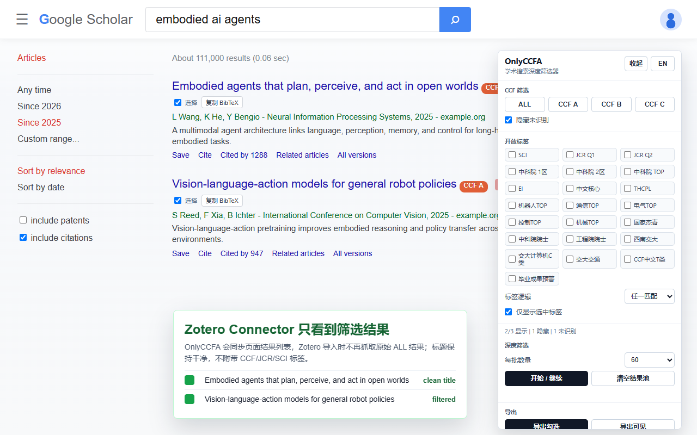

<h1 align="center">
  
  OnlyCCFA
</h1>

<p align="center">
  <a href="https://github.com/zay002/OnlyCCFA">
    
  </a>
  <a href="https://chromewebstore.google.com/detail/onlyccfa/cgbjdimlhdcjinagiacapnkmhpjkeabh">
    
  </a>
</p>

<p align="center">
  
</p>

<p align="center">
  中文 | <a href="./README_en.md">English</a>
</p>

OnlyCCFA 是一个面向科研检索场景的 Chrome 扩展，帮助用户在 Google Scholar、Semantic Scholar、IEEE Xplore、dblp、Connected Papers 和 Web of Science 等页面上直接查看论文 venue 与作者相关的质量标签，并基于这些标签进行筛选、整理和 BibTeX 导出。

项目源自 [CCFrank / CCFrank4dblp](https://github.com/WenyanLiu/CCFrank4dblp)，目前已经发展为独立维护的科研检索辅助工具。OnlyCCFA 坚持使用可解释、可审计的数据结构，不把不同来源的评价体系合并成含糊的综合分数，而是明确展示 CCF、CORE/ICORE、JCR、中科院分区、SCI、EI、TH-CPL、中文核心、方向 TOP、作者身份等具体标签。

## 项目定位

OnlyCCFA 适合需要高频检索、筛选和整理论文的学生与研究者，尤其是计算机、人工智能、机器人、机械、电气、通信、交通等方向的中文科研用户。它的目标不是替代人工判断，也不是给论文质量下最终结论，而是在日常搜索页面中尽可能透明地暴露可验证的 venue 与来源信息，减少低效翻页和重复整理。

## 核心能力

- 在 Google Scholar、Semantic Scholar、IEEE Xplore、dblp、Connected Papers 和 Web of Science 中显示 CCF 推荐等级。
- 在 Google Scholar、Semantic Scholar 和 IEEE Xplore 中提供右侧筛选面板，支持多选 CCF A/B/C、开放标签组合筛选、结果统计和本地偏好保存。
- 支持 CORE/ICORE、SCI、JCR Q1/Q2、中科院 1区/2区/TOP、EI、TH-CPL A/B、中文核心、国家杰青、中科院院士、工程院院士、西南交大相关目录，以及机器人/通信/电气/控制/机械等方向 TOP 标签。
- Google Scholar 支持深度筛选，可按批次扫描多页搜索结果，构建本地候选结果池，并继续下一批或清空重来。
- Google Scholar 个人主页支持论文表标注、组合筛选、单篇复制 BibTeX 和批量导出，默认显示 ALL，避免打开作者主页时隐藏论文。
- BibTeX 导出优先使用 DOI、arXiv ID 或严格标题匹配请求 Crossref / arXiv；Google Scholar 原生引用链接只作为低频兜底，不从页面摘要臆造引用字段。
- 与 Zotero Connector 兼容：筛选 Google Scholar 时，未命中结果会临时移出列表，使 Zotero Connector 只看到当前筛选后的候选论文。
- 对 workshop 论文给出独立标记，避免把 workshop 结果误认为主会论文。
- 对同一结果的 CCF badge 做去重与强等级保护，降低异步回退匹配带来的错误叠加风险。

## 效果示意

| 深筛结果池                                                                                                       | 多来源组合筛选                                                                                                           |
| ---------------------------------------------------------------------------------------------------------------- | ------------------------------------------------------------------------------------------------------------------------ |
|  |  |

| 方向 TOP 标签                                                                                             | 继续下一批                                                                                                      |
| --------------------------------------------------------------------------------------------------------- | --------------------------------------------------------------------------------------------------------------- |
|  |  |

| 干净 BibTeX 导出                                                                                         | Zotero Connector 只识别筛选后结果                                                                                           |
| -------------------------------------------------------------------------------------------------------- | --------------------------------------------------------------------------------------------------------------------------- |
|  |  |

## 安装

推荐从 Chrome Web Store 安装稳定版本：

[OnlyCCFA - Chrome Web Store](https://chromewebstore.google.com/detail/onlyccfa/cgbjdimlhdcjinagiacapnkmhpjkeabh)

GitHub Release 通常会比 Chrome Web Store 更快更新。Chrome Web Store 版本需要经过审核，可能晚于 GitHub 上的最新版本；如果希望第一时间测试新功能，可以从 Release 下载 zip 后以开发者模式加载。

从源码加载：

1. 打开 `chrome://extensions`。
2. 开启 `Developer mode`。
3. 点击 `Load unpacked`。
4. 选择本仓库目录。
5. 修改代码后，在扩展管理页点击 reload，再刷新目标检索页面。

## 数据与匹配原则

OnlyCCFA 的数据按来源拆分维护，便于审计和回滚：

- `data/openRankSources.js`：通用开放 venue、方向 TOP、中文核心等种子数据。
- `data/journalRankSources.js`：JCR 2025 与中科院升级版 2025 期刊分区数据，JCR 更新参考 [hitfyd/ShowJCR](https://github.com/hitfyd/ShowJCR)。
- `data/coreRankSources.js`：CORE/ICORE 2026 会议评级数据，来自 [CORE 官方 portal](https://portal.core.edu.au/conf-ranks)，采集方式参考 [benkeks/icore-ranks](https://github.com/benkeks/icore-ranks)。
- `data/thcplRankSources.js`：TH-CPL 推荐目录数据。
- `data/swjtuRankSources.js`：西南交大相关公开目录派生标签。
- `data/authorRankSources.js`：公开作者身份标签，包括两院院士名单和国家杰青公开整理种子。

匹配逻辑遵循以下原则：

- 优先使用完整 venue 名称、明确简称和可解释的归一化规则。
- 不把 CCF、JCR、中科院、TH-CPL、方向 TOP 等来源合并成单一分数。
- 不复制来源不明或授权不清的数据包。
- 对作者身份只使用中文名、官方英文名或完整全拼别名，不使用 `X Wang` 这类高歧义缩写。
- 对同名或简称歧义保持保守；完整标题优先，无法可靠区分时不强行推断。

## 隐私与限制

OnlyCCFA 在浏览器本地运行，不需要账户登录，也不会收集个人检索记录。筛选偏好、语言、面板位置等设置保存在浏览器本地存储中。

批量 BibTeX 导出可能访问 Crossref、arXiv、Google Scholar 或 Semantic Scholar 等公开元数据入口。OnlyCCFA 已尽量减少请求次数并使用缓存，但短时间内反复大批量导出仍可能触发目标网站的访问限制。

所有标签只作为检索辅助信息。不同机构、学科和评价场景可能采用不同标准，请以目标单位或官方文件为准。

## 开发与发布

常用命令：

```bash
npm test
npm run format:check
npm run check:release
npm run benchmark:rank
npm run package
```

发布前应至少通过测试、格式检查、release health 检查和本地打包。GitHub Release 的 zip 由 `npm run package` 生成。

## 贡献

欢迎通过 issue 或 pull request 提交问题、数据修正和功能改进。数据贡献请尽量提供官方公开链接、版本日期和可复核来源；功能贡献请附带必要测试，尤其是 venue 匹配、badge 去重、BibTeX 导出和筛选状态相关逻辑。

## 致谢

OnlyCCFA 当前由 [Zhaoyang Li](https://github.com/zay002) 维护。

本项目基于 CCFrank / CCFrank4dblp。感谢 Wenyan Liu 以及所有 CCFrank 贡献者在原始扩展、CCF 数据、平台支持、问题修复和长期维护上的工作。JCR 2025 更新参考了 [hitfyd/ShowJCR](https://github.com/hitfyd/ShowJCR) 的公开整理数据。没有这些基础，OnlyCCFA 不会这么快站起来。

原项目：[WenyanLiu/CCFrank4dblp](https://github.com/WenyanLiu/CCFrank4dblp)

## 贡献者

<table>
  <tbody>
    <tr>
      <td align="center" valign="top" width="14.28%">
        <a href="https://github.com/zay002">
          
          <br />
          <sub><b>Zhaoyang Li</b></sub>
        </a>
        <br />
        Code, documentation, tests, maintenance
      </td>
      <td align="center" valign="top" width="14.28%">
        <a href="https://github.com/dongyangli-del">
          
          <br />
          <sub><b>dongyangli-del</b></sub>
        </a>
        <br />
        Filter panel, TH-CPL badges, tests
      </td>
    </tr>
  </tbody>
</table>

## License

OnlyCCFA 使用 MIT License 发布。

原始 CCFrank 版权声明已保留。OnlyCCFA 修改部分 copyright 2026 Zhaoyang Li。
